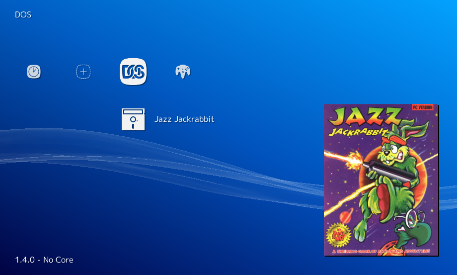

# libretro-database-dos

Builds [libretro-database's DOS.dat](https://github.com/libretro/libretro-database/blob/master/dat/DOS.dat) to allow running DOS games directly from [RetroArch](https://www.libretro.com/).

## Build

1. Retrieve the latest TDC DAT
2. Save it as TDC.dat
3. Run `npm install`
4. Run `npm test`
5. See the output at [DOS.dat](DOS.dat)
